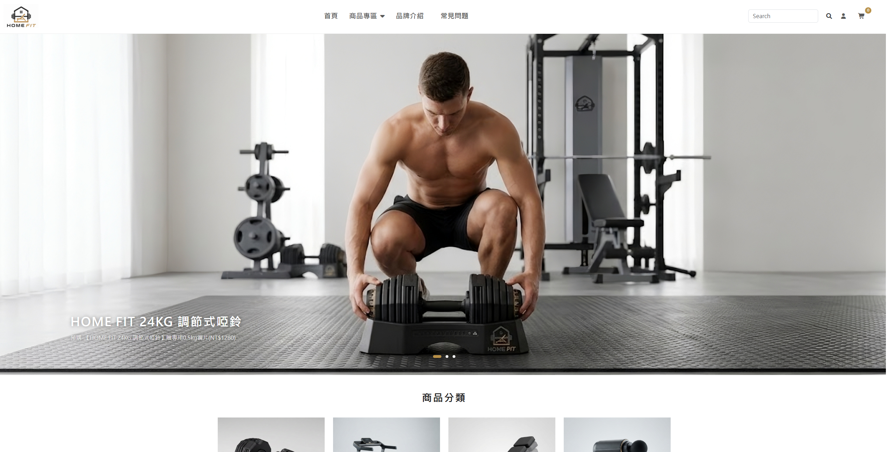
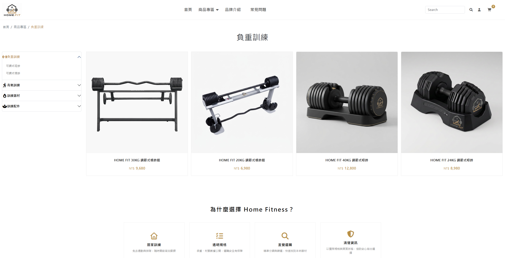
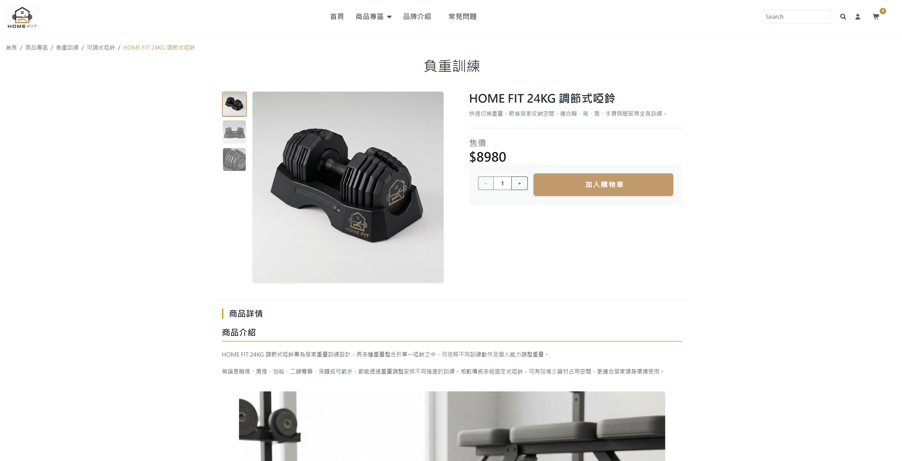
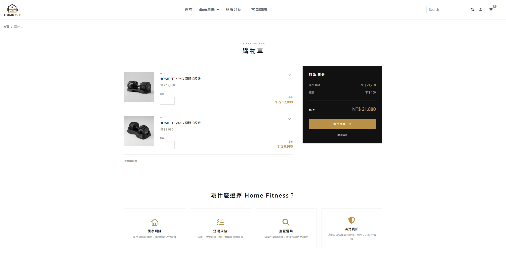
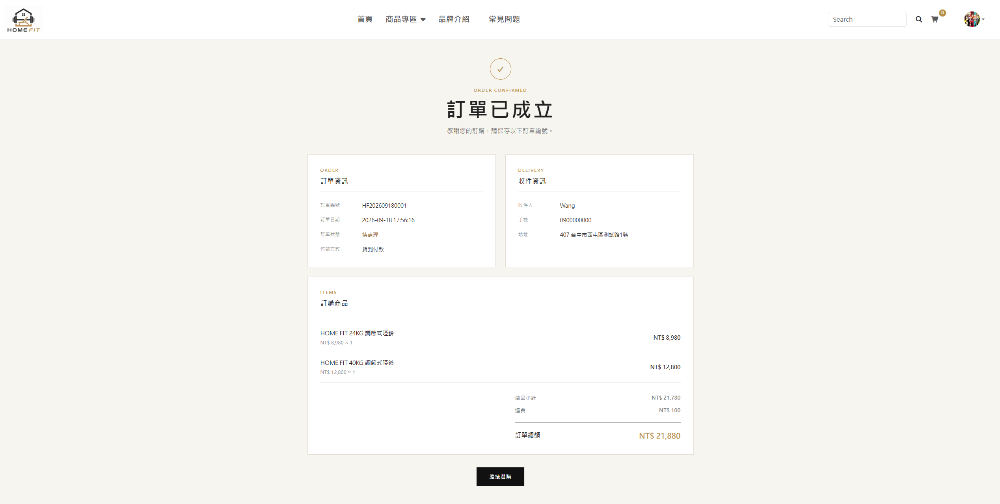
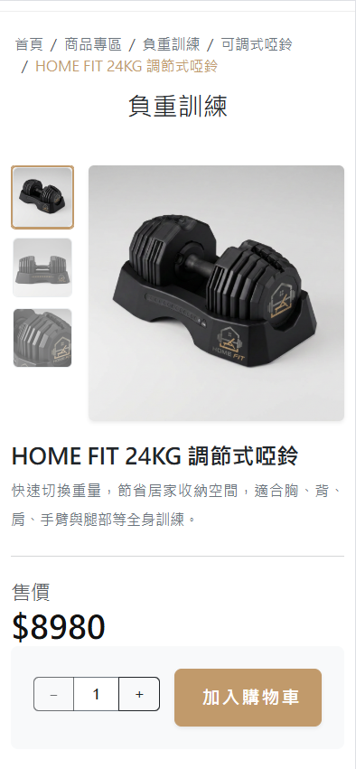
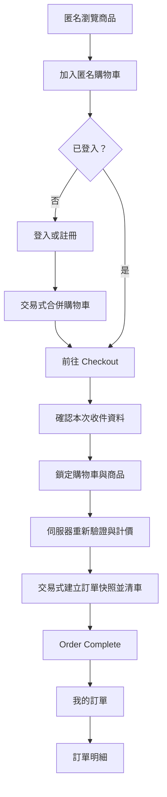

# Home Fitness

Home Fitness 是一個由職訓課程專案持續重構與完善而成的原生 PHP 電商作品，涵蓋商品瀏覽、會員、匿名／會員購物車、結帳與訂單查詢流程。除了購物介面，專案也逐步改善購物車歸屬、交易式結帳、訂單快照、舊密碼遷移與伺服器端驗證。本專案主要展示 PHP 後端與全端開發能力，並包含響應式前端介面實作；並非實際營運中的商業平台。

## 線上展示

- Demo：https://homefitness-demo.infinityfreeapp.com/
- 此站為作品集展示環境，請使用虛構測試資料，勿輸入真實個人資訊。
- 可自行註冊測試會員，體驗匿名購物車、會員註冊、購物車合併、結帳與訂單查詢流程。

## 專案畫面

### 首頁

### 購物流程

| 商品列表 | 商品詳細 |
| --- | --- |
|  |  |

| 購物車 | 訂單完成 |
| --- | --- |
|  |  |

響應式頁面亦針對手機版進行調整：

## 專案簡介

以虛構的居家健身品牌為情境，串起從選購到查詢歷史訂單的使用者流程。前端以共用 PHP 元件、分檔 CSS 與 Bootstrap 製作響應式頁面；後端採原生 PHP 與 PDO，將購物車歸屬、資料驗證和訂單一致性放在伺服器端處理。

## 重構背景

本專案源自職訓課程作品，目前 repository 呈現的是在既有原生 PHP 程式上持續重構後的版本。現有版本可由程式與 schema 驗證的改善包含匿名／會員購物車歸屬與交易式合併、密碼漸進式遷移、CSRF、交易式結帳、訂單快照與重複建單防護；另外也整理上傳目錄防護與正式部署注意事項。保留原生 PHP 與既有頁面結構，是為了練習閱讀、維護與漸進改善既有系統。由於 repository 未保存可完整比較的課程初版，本頁不逐項區分哪些功能原先已有、哪些由後續重構新增。

## 主要功能

| 範圍 | 已完成的使用者功能 |
| --- | --- |
| 商品 | 首頁輪播與推薦商品、二層分類、名稱搜尋、商品列表與分頁、詳細資訊與多圖燈箱；單項數量為 1～49。 |
| 會員 | Email 註冊、可選 Avatar 上傳、登入與登出；註冊成功後自動登入。 |
| 購物車 | 匿名與會員皆可加入商品、修改數量、刪除單項或清空；登入或註冊後自動合併匿名購物車。 |
| 結帳 | 必須登入；預填會員收件資料，可修改本次訂單資料而不回寫會員地址。僅支援貨到付款，固定運費 NT$100；建單時重新驗證商品並由伺服器重新計價。 |
| 訂單 | Order Complete、我的訂單與訂單明細；保存商品及收件資訊快照，訂單編號格式為 `HFYYYYMMDD####`。 |
| 內容 | Brand 品牌介紹與 FAQ 常見問題。 |

## 核心購物流程

匿名使用者點選結帳時會先導向登入；登入成功可返回結帳頁。若直接從註冊頁建立帳號，註冊成功目前會返回首頁，購物車合併後可再前往結帳。

## 技術棧

| 層面 | 使用技術 |
| --- | --- |
| 後端 | PHP 8.2+、PDO MySQL；原生 PHP，未使用 PHP Framework。 |
| 資料庫 | MariaDB／MySQL。公開範例資料庫由 MariaDB 匯出。 |
| 前端 | HTML5、CSS、JavaScript、Bootstrap 5.3.8、jQuery 3.7.1、jQuery Validation Plugin 1.13.0、PhotoSwipe 5.4.4、Font Awesome 7.3.0。 |

## 核心工程亮點

1. **交易式結帳**：同一資料庫 transaction 中以 `SELECT ... FOR UPDATE` 鎖定會員預填地址、待結帳購物車與相關商品列，檢查商品是否上架及數量是否為 1～49，並以資料庫中的商品價格重新計算金額。建立 `uorder` 與 `order_items` 快照後，會在 commit 前刪除本次購物車列；若刪除筆數不符或任一步失敗即 rollback。此專案未實作庫存扣減，因此 row lock 用於結帳當下的資料一致性，不宣稱防超賣。
2. **匿名／會員購物車歸屬與合併**：匿名購物車以隨機 Session token 識別，原值留在 Session，資料庫只保存 SHA-256 hash；會員購物車以登入會員 ID 限定範圍。更新及刪除都同時檢查 owner，不只依賴 cart ID。登入或註冊後，以 transaction 合併相同商品並限制數量上限。
3. **訂單快照**：訂單明細保存成交時的商品名稱、單價、數量及小計，訂單主檔保存當次收件資料。歷史訂單因此不依賴之後可能變動的商品名稱、價格或會員地址。
4. **舊會員密碼漸進式升級**：新會員密碼以 `password_hash(PASSWORD_DEFAULT)` 保存；現代 password hash 以 `password_verify()` 驗證，並在 `password_needs_rehash()` 判定需要時嘗試更新，若重新雜湊寫回失敗仍可用已驗證的原 hash 完成本次登入。舊 MD5 僅接受 32 位小寫十六進位格式；比對成功後會先產生新 hash 並條件式寫回，升級成功才通過本次登入，未知格式則拒絕。前端不計算 MD5。
5. **避免重複建單**：Checkout 將隨機 submission token 原值放入表單、在 Session 保存其 SHA-256 hash；新訂單須先通過 Session hash 比對。`uorder.submission_token_hash` 另有唯一索引，程式會在建單前及 transaction 例外後依會員與 token hash 查找既有訂單，成功請求重送時導回原訂單。

## 安全與資料一致性設計

| 設計 | 做法 |
| --- | --- |
| Session | Strict mode、HttpOnly、SameSite=Lax；PHP 依 `$_SERVER['HTTPS']` 為 `on`／`1` 或 `SERVER_PORT` 為 `443` 判定目前請求為 HTTPS 時設定 Secure cookie，登入與註冊自動登入前以 `session_regenerate_id(true)` 更新 Session ID。 |
| 請求與資料 | 目前主要狀態變更 POST 入口，包括註冊、登入／登出、購物車增刪改、建立訂單及 Avatar 上傳，皆驗證 CSRF token；註冊、購物車與結帳均有伺服器端驗證；PDO prepared statements 處理資料庫輸入。 |
| 存取範圍 | 購物車查詢／修改帶入匿名 token hash 或會員 ID；訂單查詢同時限定訂單編號與登入會員 ID。 |
| 輸出與上傳 | 共用 `e()`、安全圖片檔名與 JavaScript 值編碼 helper；Avatar 驗證實際檔案類型、尺寸與 Session 中的上傳紀錄。 |

商品 `p_content` 是受控商品資料的 HTML 輸出例外；若日後開放一般使用者或後台編輯，需另加 HTML allowlist 清理。詳見[輸入驗證與輸出編碼](docs/input-output-security.md)。

## 測試與驗證

目前 repository 尚未建立 automated test suite，也未配置 CI test pipeline；現階段以手動情境測試與部署後驗收為主。若持續維護此專案，會優先為 Checkout 與 Cart Merge 補上 integration tests。部署環境的 HTTP 回應、Cookie 屬性與 Web Server 規則仍須在實際主機逐項驗證，不能只由原始碼推定。

## 本機安裝

1. Clone repository，進入專案根目錄。準備 PHP 8.2+、MariaDB／MySQL，並啟用 PHP 的 `PDO`、`pdo_mysql`、`fileinfo` extension。
2. 使用資料庫管理工具匯入 `database/expstore.sample.sql`。範例會建立 `expstore`，包含目前所需 schema 與商品／地區資料，不包含會員或訂單資料。**Fresh install 不需再執行** `database/migrations/20260913_order_core.sql`；該 migration 供既有舊資料庫升級參考。
3. 複製 `.env.example` 為 `.env`（Windows PowerShell：`Copy-Item .env.example .env`），設定 `DB_HOST`、`DB_PORT`、`DB_DATABASE`、`DB_CHARSET`、`DB_USERNAME`、`DB_PASSWORD`。建議使用本專案專用的資料庫帳號。
4. 確認 `uploads/` 可由 PHP 寫入。在專案根目錄執行 `php -S 127.0.0.1:8000`，開啟 `http://127.0.0.1:8000/`。此網址僅供本機開發；前端 CDN 資源需可連線。

正式部署需使用 HTTPS、設定 PHP `display_errors=Off`、`log_errors=On`，且禁止 `uploads/` 執行 PHP／CGI。本機 PHP 開發伺服器不套用 `.htaccess`，不能用來驗證上傳目錄的部署保護。完整設定見[本機啟動方式](docs/setup.md)及[上傳目錄部署設定](docs/uploads-security.md)。

`.gitignore` 已忽略 `.env`，但這只能避免檔案被提交至 Git，不能取代 Web Server 的存取控制。程式會從專案根目錄讀取 `.env`，而 repository 根目錄目前沒有封鎖該檔案的 Apache／Nginx 規則，因此正式部署仍須由主機環境設定並驗證存取限制。repository 內的 `uploads/.htaccess` 會在允許覆寫設定的 Apache 環境停用 CGI、移除 PHP／CGI handler、禁止目錄列表並拒絕非允許圖片副檔名；其他 Web Server 需使用等效規則。

## 作品範圍與改善歷程

目前付款方式只有貨到付款，訂單建立時狀態為「待處理」。專案尚未實作 Admin 後台、線上信用卡／ATM／第三方金流、庫存管理、物流追蹤、Email 通知、密碼重設、會員資料或地址簿管理，以及取消訂單／退款流程。

在原始課程功能基礎上，逐步將資料庫憑證移至本機設定、把舊 MD5 會員遷移到 `password_hash()`，整理 Session 與 CSRF，將購物車歸屬由舊 IP 欄位改為匿名 token／會員 ID，再補上伺服器端驗證、輸出編碼、交易式結帳、訂單快照與會員限定的訂單查詢，最後調整表單回饋與購物流程 UX。

更多維護資訊：[專案目錄結構](docs/structure.md) · [前端依賴](docs/dependencies.md)。
